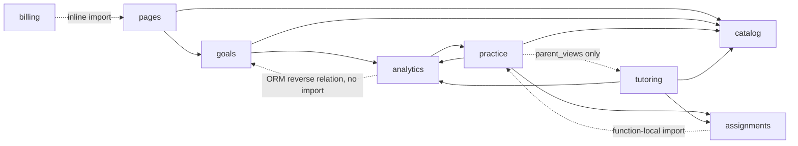
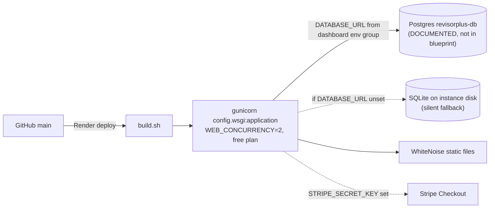

# RevisorPlus — current-state architecture

A snapshot of the architecture **as implemented** in this repository. It describes what
exists and how it behaves. It does not score the design, propose a target, or repair
anything. Where the repository's own documents describe an intent or a known problem,
that is quoted as `DOCUMENTED` and kept separate from what was read out of the code.

Every claim carries one of four labels:

| Label | Meaning |
|---|---|
| `OBSERVED` | Read directly from the cited file at the snapshot revision, this session. |
| `DOCUMENTED` | Stated by a repository document (README, `render.yaml` comment, `docs/known-issues.md`). Not independently re-verified. |
| `INFERRED` | Follows from observed facts but was not itself read or executed. |
| `UNKNOWN` | Could not be established from repository evidence. |

---

## 1. Snapshot identity

| | |
|---|---|
| Remote | `origin` → `https://github.com/NidsC/revisor-plus.git` |
| Revision | `origin/main` @ `7f97c969` (merge commit, 2026-09-12) |
| Observation date | 2026-09-15 |
| Worktree | Checked out at `main` = `7f97c969`. Three untracked, non-code files at the root (`Carshalton and Sutton (1).xlsx`, `Outreach_Research_and_Evaluation_Criteria.md`, `clean_up.md`); no tracked modifications. |
| Evidence cutoff | All code claims were read from `origin/main` via `git show`/`git grep` after a fresh `git fetch`. The session began on `questions/nidsc-nvr-03` (205 commits behind); that branch's one extra commit is a data-only question pack and does not affect anything below. |

Two gitignored working-note files (`pending_issues.md`, `plans.md`) exist in this
checkout. They are referenced below only where they corroborate or contradict something
observed; they are not evidence on their own.

---

## 2. System context

**What it is.** A single Django 5.1 web application for 11+ exam practice
(`requirements.txt`: `Django==5.1.15`, `OBSERVED`). Pupils drill a bank of questions
across four papers — English, Maths, Verbal Reasoning, Non-Verbal Reasoning — sit mock
papers, and get a weakness/readiness report. Tutors link to pupils, set homework, and
message them. A "parent dashboard" reuses the pupil's own account (no parent role exists;
`tutoring/models.py:29-34` docstring, `OBSERVED`).

**Actors** (`accounts/models.py:1-24`, `OBSERVED`): one custom user model
`accounts.User(AbstractUser)` with `role ∈ {student, tutor, admin}`, default `student`.
Sign-up goes through django-allauth; a custom adapter defaults new users to `student`
(`accounts/adapter.py:1-13`).

**External systems**

| System | How it is reached | Status |
|---|---|---|
| Render (hosting) | `render.yaml`; one free-tier web service, `gunicorn config.wsgi:application` | `OBSERVED` declared config; live topology `UNKNOWN` |
| Postgres `revisorplus-db` | `DATABASE_URL` env var read by `dj_database_url` (`config/settings.py:97-100`) | `DOCUMENTED` as live since 2026-08-25 (`render.yaml` header comment); not verifiable from the repo — see §6 |
| Stripe | `stripe==15.3.1`; keys from env (`config/settings.py:182-184`) | `OBSERVED` code; no webhook handler; demo bypass when the key is unset (`billing/views.py:44`) |
| `api.postcodes.io` | stdlib HTTP client in `school_onboarding/postcodes.py` | `OBSERVED` code; the app that uses it is **not installed** (§3) |
| GitHub Actions | `.github/workflows/validate-questions.yml` | `OBSERVED` |

There is no task queue, cache backend, message broker, or email provider configured
(`requirements.txt`, `config/settings.py`; `OBSERVED`). Allauth is set to require no
email verification (`config/settings.py:144`, `OBSERVED`).

---

## 3. Component inventory

One deployable process; one codebase. Internally it is organised as Django apps plus one
plain Python package. Dependency direction is summarised in §4.

### 3.1 Installed Django apps (`config/settings.py:41-58`, `OBSERVED`)

| App | Responsibility | Owns models | Owns URLs |
|---|---|---|---|
| `accounts` | Custom user model with a `role` field; allauth adapter. No views of its own. | `User` | — (allauth mounted at `/accounts/`) |
| `catalog` | The question bank: taxonomy rows, questions, answer options, marking, passage rendering. No HTTP surface (`catalog/views.py` is a stub). | `Section`, `Subtopic`, `Question`, `AnswerOption` | — |
| `practice` | Practice decks, mock papers, targeted papers, answer submission, pupil dashboard, parent dashboard. The largest app. | `TestSession`, `Attempt` | `practice/urls.py` |
| `tutoring` | Tutor↔pupil links and per-link messaging; tutor dashboard; authorisation spine `_owned_link()`. | `TutorStudent`, `TutorMessage` | `tutoring/urls.py` |
| `assignments` | Homework tracking. A model whose status is *derived* from `practice.Attempt` counts, not self-reported. No views, no URLs. | `Assignment` | — |
| `billing` | A `Subscription` per user; Stripe checkout with a no-key demo fallback; a context processor that injects `is_subscribed` into every template. | `Subscription` | `billing/urls.py` |
| `goals` | Target school, exam date, target hours/accuracy per paper. Deliberately carries **no pass-mark** (docstring, `goals/models.py:8-49`). | `School`, `Goal`, `SectionTarget` | `goals/urls.py` |
| `pages` | Landing page and post-login role router. No models. | — | mounted directly in `config/urls.py` |

Third-party: `django.contrib.{admin,auth,contenttypes,sessions,messages,staticfiles,sites}`,
`allauth`, `allauth.account`.

### 3.2 Not an app, but load-bearing

**`analytics/`** — a plain package (`__init__.py`, `services.py`, `readiness.py`; no
`apps.py`, no models; absent from `INSTALLED_APPS`). It is the only place accuracy,
coverage, weakness and readiness are computed, and is imported by `practice`, `goals`,
`pages`, `tutoring` and two test scripts (`OBSERVED` via `git grep`). Treat it as a shared
domain-logic library that reads `practice.Attempt` and `goals.Goal`.

**`elevenplus_data/`** — the authoring pipeline, not runtime code. `taxonomy.json` is the
single source of truth for sections/subtopics/question types (4 sections, all
`rebuilt: true`; MAT 17 subtopics, ENG 34, VR 24, NVR 7; 43 controlled misconception
slugs — counted this session, `OBSERVED`). `validate_questions.py` is a stdlib-only
contract checker with exit codes 0/1/2. Question packs are JSON files; only
`contrib_*.json` and `*-paper-*.json` deploy (`build.sh`, `OBSERVED`).

### 3.3 Present in the tree but **not wired in** (`OBSERVED`)

**`school_onboarding/`** is a complete Django app — models (`School` from the DfE GIAS
import, `StudentTargetSchool`, `SchoolOnboardingState`), admin, two migrations, a
management command, a `postcodes.io` client, and a middleware that force-redirects
non-staff students into onboarding until finished (`school_onboarding/middleware.py:9-58`).
It is **not** in `INSTALLED_APPS`, not in `MIDDLEWARE`, and not included by
`config/urls.py` (`git grep school_onboarding origin/main -- config/` returns nothing).
`install_school_onboarding.py` at the root is a patcher that would wire it in;
`config/settings.py` and `config/urls.py` are byte-identical to their
`.before_school_onboarding` backups, so the patcher has not been applied to this tree.

Consequence worth naming: there are **two unrelated `School` models** —
`goals.models.School` (live; used by `pages` and `goals`) and
`school_onboarding.models.School` (dormant). Same name, different tables, different
fields.

### 3.4 Drop-in installer pattern (`OBSERVED`)

Three root-level one-shot patchers exist, each leaving `.before_*` backups:
`install_school_onboarding.py` (not applied, above), `install_student_portals.py`
(`templates/base.html.before_student_portals` differs substantially from the current
`base.html` — consistent with having been applied and then further edited), and
`apply_parent_dashboard.py` (a `.parent-dashboard-backup/20260910-203045/` snapshot is
checked in; `practice/parent_views.py` and the `parent/` route exist, consistent with
having been applied). None of these run in the build or CI. Whether each was ever run
against a *deployed* environment is `UNKNOWN`.

---

## 4. Dependency direction and data flow

### 4.1 Import graph between local components (`OBSERVED` via `git grep` of import lines)

Notes:

- `catalog` imports nothing from the other local apps. It is the bottom of the graph.
- `analytics → practice` is a real import (`Attempt`). `analytics → goals` is structural,
  not textual: `readiness.active_goal()` walks `student.goals`, the reverse FK Django
  wires from `goals.Goal.student`. `goals/views.py` in turn imports
  `analytics.readiness`. So `goals` and `analytics` are mutually dependent at runtime
  even though only one direction shows up as an `import`.
- `assignments/models.py:29` imports `practice.Attempt` inside a method body. Without
  that, `practice → assignments → practice` would be a module-level cycle.
- No module-level circular imports were found among the local apps.

### 4.2 Data ownership

| Data | System of record | Written by | Read by |
|---|---|---|---|
| Taxonomy (sections, subtopics, question types) | `elevenplus_data/taxonomy.json` | humans / `/questions` sessions | `sync_taxonomy` → `catalog.Section`/`Subtopic`; validator; importers |
| Authored questions | `elevenplus_data/contrib_*.json` in git | humans via `/questions` → PR | `import_pack` on every deploy |
| Generated questions | `catalog.Question` rows with `source="GEN"`, `gen_key` sha1 | `generate_bank` on every deploy | serving paths — but all rows are `active=False` (§5.2) |
| Pupil history | `practice.Attempt` | `practice.views.answer()` only | `analytics`, `assignments.Assignment.progress_count()`, `practice.views.mock_result` |
| Goals, tutor links, subscriptions | DB rows in `goals`, `tutoring`, `billing` | their own views | `analytics.readiness`, `pages.after_login`, context processor |
| In-flight deck | `request.session["deck"]` (server session) and `TestSession.deck_state` when paused | `practice.views.start*`/`answer` | `practice.views.question`/`answer` |

The database is the only store for pupil history; nothing exports it. `backup.sh`
produces a gitignored full dump and a committable questions-only dump
(`elevenplus_data/catalog_backup.json`, gitignored) — manual, not scheduled (`OBSERVED`).

---

## 5. Domain model essentials (`catalog/models.py`, `practice/models.py`; `OBSERVED`)

### 5.1 Question bank

- `Section(code unique ∈ {ENG,MAT,VR,NVR}, name, order)`.
- `Subtopic(section FK CASCADE, name, order, topic: str, topic_order)`. `topic` is a
  plain string, not a FK — the model comment says this is deliberate, to avoid a cascade
  path into `Attempt` when the taxonomy is revised.
- `Question(subtopic FK CASCADE, parent self-FK CASCADE related_name=parts, kind,
  question_type: slug, also_tests: JSON, passage/instruction/worked_example, difficulty
  1–5, active bool default True, source: str, gen_key: sha1 indexed, marking fields,
  figure: JSON)`. Eight `kind`s: `mcq, numeric, short_text, extended_text, error_span,
  select_word, cloze_gap, grouped_options`. Index `(subtopic, active, difficulty)` for the
  deck-building path. **No `ref`, `number`, or `pool` field exists.**
- `AnswerOption(question FK CASCADE related_name=options, text, is_correct, order, label,
  figure: JSON, group: int, misconception: slug)`.
- Multi-part items and shared passages use `parent`/`parts`: only leaf rows
  (`parts__isnull=True`) are ever served. Group instructions and code tables are copied
  onto each question rather than held on the container (design decision recorded in
  `elevenplus_data/CLAUDE.md`, `DOCUMENTED`).

### 5.2 The `active` gate

Every serving query filters `active=True, parts__isnull=True`: four sites in
`practice/views.py` (practice start, section pool, targeted-paper pool, mock pool) and
`pages/views.py:24` (landing count) (`OBSERVED`). `build.sh:60` runs
`generate_bank … --inactive`, which writes `active=False` on every generated row, so the
~4,600-question generated bank is uniformly absent from practice, mocks and counts on
every deploy. `import_pack` never sets `active`, so authored questions take the model
default `True`.

### 5.3 Pupil history

- `TestSession(student FK, subtopic FK nullable, mode ∈ {practice, test, homework},
  time_limit_seconds, deck_state JSON, started_at, finished_at)`.
- `Attempt(session FK CASCADE, student FK CASCADE, question FK **CASCADE**
  (`practice/models.py:36`), subtopic FK CASCADE, selected_option FK nullable,
  answer_given, is_correct, marks_earned, marks_available, awaiting_marking, time_taken_ms,
  source, created_at)`. Indexes `(student, subtopic)` and `(created_at)`. This is the
  analytics spine — one row per answered question.

### 5.4 Marking (`catalog/marking.py`, `OBSERVED`)

Single entry point `mark(question, given, option, options) -> Result`, dispatching on
`Question.kind`: rubric/`extended_text` → `awaiting_marking=True`; `grouped_options` →
all-or-nothing across brackets; `mcq/error_span/select_word/cloze_gap` → option
correctness; `numeric` → tolerance with a permissive number parser; `short_text` →
keyword match with reject-list precedence and the canonical answer always checked. A wrong
option's `misconception` slug is surfaced as `Result.detail` for pupil feedback.

---

## 6. Runtime topology and deployment

### 6.1 Declared deployment (`render.yaml`, `OBSERVED` as configuration)

- One `web` service, `runtime: python`, `plan: free`, `PYTHON_VERSION=3.12.7`,
  `DJANGO_DEBUG=0`, auto-generated `DJANGO_SECRET_KEY`. Start command is WSGI only;
  `config/asgi.py` exists but nothing declared uses it (`OBSERVED`).
- **No `databases:` block.** The file's own header (`DOCUMENTED`) states a Postgres
  instance was created via the dashboard on 2026-08-25 and that `DATABASE_URL` is
  supplied by a dashboard environment group. It also states the corollary explicitly:
  *nothing in this repo records which database the app uses*; if the variable goes
  missing, `settings.py` falls back to SQLite on the instance disk with no error.
  `build.sh` prints the connected DB vendor before doing any work as the only
  observability point. **Live database vendor: `UNKNOWN` from repository evidence.**
- No health check, autoscaling, cron, or second service is declared (`OBSERVED`).
- Static files are served by WhiteNoise from the same process
  (`config/settings.py:174`, `STORAGES`).
- `DEBUG` defaults to on locally (`DJANGO_DEBUG` default `"1"`) but to off whenever
  `RENDER_EXTERNAL_HOSTNAME` is set, where a missing `DJANGO_SECRET_KEY` also raises at
  startup (`config/settings.py`, "Core" block); production hardening (SSL redirect,
  secure cookies, HSTS 3600s) is gated on `not DEBUG`.

### 6.2 Build sequence (`build.sh`, `OBSERVED`, in order)

1. `pip install -r requirements.txt`
2. Print the connected database vendor/name/host (diagnostic only)
3. `collectstatic --no-input`
4. `migrate`
5. `sync_taxonomy` — must precede every importer; importers `get_or_create` subtopics by
   name, so running this first prevents silent duplicates (comment, `build.sh:22-39`)
6. `seed_demo`
7. `generate_bank --per-module 1150 --seed 11 --inactive` (`build.sh:60`)
8. For each `elevenplus_data/contrib_*.json`: `import_pack` — failure is reported and
   **skipped**, not fatal
9. For each `elevenplus_data/*-paper-*.json`: `import_paper --skip-if-present` — also
   skip-on-failure
10. Print a summary naming every skipped file

The build therefore **rewrites the question bank on every deploy**. `sync_taxonomy` never
deletes; `generate_bank` retires rather than deletes rows that have attempts;
`import_pack` is `@transaction.atomic` (`import_pack.py:265`) and deletes then recreates
every question scoped to `(source, section)` (`import_pack.py:296-303`).

### 6.3 Startup, shutdown, health, recovery

- Startup: gunicorn imports `config.wsgi` → `config.settings`. No warm-up, no readiness
  probe (`OBSERVED`).
- Shutdown / restarts: nothing in the repo handles them; Render free-tier idle
  spin-down is mentioned only in the `render.yaml` comment (`DOCUMENTED`).
- Health: `UNKNOWN` — no endpoint or Render `healthCheckPath` declared.
- Observability: Django default logging; the build-time DB-vendor print is the only
  purpose-built diagnostic (`OBSERVED`).
- Recovery: `backup.sh` (manual). `render.yaml` comment states free Postgres expires 30
  days after creation with no Render backups (`DOCUMENTED`).

### 6.4 CI (`.github/workflows/validate-questions.yml`, `OBSERVED`)

Single workflow, triggered on `pull_request` for an explicit path list (packs, catalog,
tests, CI files) — not a whole-repo CI. Two jobs:

- **`validate`** (no DB): runs `validate_questions.py` over the template, all
  `_EXAMPLE.*` and all `contrib_*` packs in one invocation (enables cross-pack checks);
  generator exhaustiveness tests (`test_figures`, `test_compound_words`,
  `test_word_analogies`, `test_odd_one_out`); `test_validator`, `test_preview_questions`;
  several advisory checks that never fail the job (`diversity_audit.py`, `audit_packs.py
  || true`, `check_nvr_board_coverage.py`, `check_evidence_refs.py`).
- **`pipeline`** (Django): `check`, `makemigrations --check`; `test_verbal_gap_batch`,
  `test_generator_contract`; then builds a **fresh SQLite** DB (`migrate` →
  `sync_taxonomy` → `seed_demo` → the four `_EXAMPLE.*` packs) and imports every
  `contrib_*.json` — here a failed import **fails the job** (the deploy skips instead);
  then `test_kinds`, `test_taxonomy`, `test_import_safety`, `test_misconceptions`, each
  run via `main.py shell < test.py` and gated by `grep -q "RESULT: ALL PASSED"`; finally
  `generate_bank --per-module 60 --seed 11` (no `--inactive`; throwaway DB) and
  `test_nvr_page`.

CI never touches Postgres. `test_adaptive.py` is not referenced by the workflow
(`OBSERVED`; `pending_issues.md` records this as deliberate).

---

## 7. Critical flows

### 7.1 A question travels from a pack file to a pupil's screen

1. Author writes `elevenplus_data/contrib_<x>.json` (typically through the `/questions`
   command) and runs `validate_questions.py` locally.
2. PR → CI `validate` (contract + cross-pack) and `pipeline` (real import into a scratch DB,
   hard-fail on error).
3. Merge → Render build runs `build.sh` §6.2. `import_pack` resolves subtopic slug→name via
   `taxonomy.json`, builds passage containers, deletes existing rows for the pack's
   `(source, section)`, and recreates `Question` + `AnswerOption` rows inside one
   transaction.
4. Serving queries pick the row up through the `active=True, parts__isnull=True` filter
   (§5.2).

Consistency: per-pack atomic; across packs sequential and skip-on-failure. A pack that
fails at deploy is simply absent until the next successful deploy; the build log's final
summary is the only signal (`OBSERVED`).

### 7.2 A pupil practises a subtopic

| Hop | Where | What happens |
|---|---|---|
| 1 | `GET practice/start/<subtopic_id>/` → `practice.views.start` (`views.py:600-621`) | `answerable(subtopic)` = `Question.filter(subtopic, active=True, parts__isnull=True).exclude(marking=RUBRIC)` (`views.py:34-46`). Shuffle, take the requested count (default 5, clamped), pad short decks by repeating ids. Create `TestSession(mode="practice")`. Store `{session_id, qids, idx, answered, mode}` in `request.session["deck"]`. |
| 2 | `question` view | Renders `Question` at `deck["qids"][idx]`. |
| 3 | `POST practice/answer/` → `answer` (`views.py:764-853`) | Idempotency: if `deck["idx"] < len(deck["answered"])` treat as replay, write nothing. Pin to the shown question via hidden `qid`. Resolve selection (option / typed / grouped brackets). `catalog.marking.mark()`. Write **one `Attempt`**. `Assignment.refresh_status()` for any homework on that subtopic. Render immediate feedback (practice mode). |
| 4 | Later, `practice.views.dashboard`, `parent_views`, `goals.views`, `tutoring.views` | `analytics.services.compute_progress(student)` scans the pupil's `Attempt` rows once → overall/per-subtopic/per-section accuracy, weak list (evidence floor 8, fallback 3), 7-day trend. `analytics.readiness.compute_readiness` layers `goals.Goal` pace and attainment on the same rows, taking the worse of the two. |

Synchronous throughout; no background work. Transaction ownership is per-request via
Django's default autocommit — `practice/views.py` contains no reference to `transaction`
at all, so the `Attempt` write and the `Assignment.refresh_status()` update are separate
autocommitted statements (`OBSERVED` via `git grep`).

### 7.3 A pupil sits a mock or targeted paper

1. `GET mocks/` → `mock_choose` (`views.py:669`) lists the four sections with pool sizes
   from `paper_questions(section)` (`views.py:56-66`) — deliberately wider than
   `answerable()`: includes rubric-marked written questions.
2. `mock_start(section_id)` or `mock_start_targeted()` (`views.py:693`, `:718`):
   `build_paper` (stratified round-robin across subtopics, sorted by difficulty,
   `views.py:70-92`) or `build_targeted_paper` (`views.py:140-196`: `FOCUS_SHARE=0.7` of
   the paper goes to the five weakest subtopics from `weakness_profile()`, widening the
   difficulty band in steps `0,1,2,4` when a subtopic is thin). Creates
   `TestSession(mode="test")`; deck carries an absolute `ends_at` and `mode:"mock"`.
3. Each `answer()` hop is as in §7.2, except in mock mode **no feedback is rendered**;
   the view advances and redirects (`views.py:838-842`, inline rationale).
4. `mock_result` (`views.py:943-1032`) sets `finished_at`, then re-reads `Attempt` rows
   (not the session deck) grouped by subtopic — earned/available/pending-rubric marks and a
   per-question review revealing answers and misconceptions. This is the only point in a
   mock's lifecycle at which an answer is revealed.

### 7.4 Sign-in and role routing

`/accounts/*` is allauth. After login, `pages.after_login` (`pages/views.py:60-77`)
routes `admin → /admin/`, `tutor → tutoring:dashboard`, `student` with no active goal →
`goals:setup`, otherwise → `practice:dashboard` (`OBSERVED`).

### 7.5 Subscription

`billing.views.checkout` (`billing/views.py:42-48`): if `STRIPE_SECRET_KEY` is empty,
skip Stripe and redirect to `success`; otherwise create a Stripe Checkout session.
`success` (`billing/views.py:67-70`) marks the `Subscription` active directly on return;
the inline comment at line 68 says production would confirm via webhook, and **no
webhook handler exists** (`OBSERVED`: `git grep webhook origin/main -- billing/` matches
only that comment). `is_subscribed` is injected into every template by
`billing.context_processors.subscription_flags` (`config/settings.py:88`).

---

## 8. Ownership

`UNKNOWN` beyond git metadata. Commits on `origin/main` are authored by two GitHub
accounts (`NidsC`, and `sfandrw`, who authored the current merge commit) (`OBSERVED`
from `git log`). No CODEOWNERS file exists. `elevenplus_data/CLAUDE.md` and
`.claude/commands/questions.md` define the authoring contract and are the closest thing
to an ownership boundary: question content is owned by whoever opens the pack PR; the
runtime is owned by the repository as a whole.

---

## 9. Documented intent versus observed implementation

Listed without severity. Each row says which side is documented and which is observed.

| Topic | Documented | Observed |
|---|---|---|
| Production database | `render.yaml` comment: Postgres `revisorplus-db` live since 2026-08-25. Older README text (per auto-memory) said "not yet deployed" — README not re-read this session. | `settings.py` reads `DATABASE_URL` else SQLite; `build.sh` prints the vendor. Nothing in-repo pins the vendor. Live value `UNKNOWN`. |
| Re-import destroys attempts | `docs/known-issues.md` (tracked, 2026-09-09): a *successful* `import_pack` deletes and recreates questions on every deploy; `Attempt.question` is CASCADE, so pupils' history against that `(section, source)` is deleted each deploy. Measured repro cited there (5 attempts → 0). No fix attempted. | Both halves confirmed in code this session: `import_pack.py:296-303` deletes by `(source, subtopic__section)`; `practice/models.py:36` is `on_delete=CASCADE`; `build.sh` runs the importer for every pack on every deploy. The repro itself was not re-run. |
| Generated bank | `pending_issues.md`: taken offline via `--inactive` (PR #43). | `build.sh:60` carries `--inactive` on `origin/main`. Consistent. |
| Admin authoring | README (per `pending_issues.md`) advertises adding questions through `/admin/`. | `catalog/admin.py` registers `Question` with an `AnswerOptionInline` and no permission overrides; no export path exists; the bank is rebuilt from packs on every deploy. Admin-authored rows survive only until the next deploy *if* they have a `source` that no pack owns (`import_pack` scopes deletes by `source`; admin rows carry `source=""`) — the exact fate of `source=""` rows across a deploy was **not traced** this session (`UNKNOWN`). |
| School onboarding | Installer script and app exist; commit history shows an install → revert cycle. | Not installed on `origin/main` (§3.3). |
| Stripe | Inline comment: production would confirm via webhook. | No webhook endpoint; `success` view activates the subscription on redirect. |
| Mock isolation | `pending_issues.md`: a mock draws from the same bank pupils drill; a `pool` field was proposed. | No `pool` field on `Question`; `paper_questions()` filters only on section/active/leaf. Consistent with the note. |
| Traceability to pack entry | `pending_issues.md`: `ref` is validated but never stored. | No `ref`/`number` field on `Question`. Consistent. |
| Targeted-paper test | `pending_issues.md`: `test_adaptive.py` kept out of CI because it depends on bank size. | Not referenced by the workflow. Consistent. |
| `docs/*.html` | `dashboard-redesign.html`, `homepage-target.html`, `question-bank-target.html` are target/design mockups, not descriptions of the current system. | Not read this session; listed so nobody mistakes them for a current-state source. |

---

## 10. What would make this document stale

- Any change to `config/settings.py` `INSTALLED_APPS`/`MIDDLEWARE`/`DATABASES`, or to
  `config/urls.py` (§3, §6).
- Applying `install_school_onboarding.py` (§3.3) — it changes the app list, the
  middleware chain, and adds a second live `School` model.
- Any change to `build.sh` step order or flags, especially `generate_bank --inactive`
  (§5.2, §6.2).
- Adding a `databases:` block or `healthCheckPath` to `render.yaml` (§6.1).
- Changing `Attempt.question`'s `on_delete`, or `import_pack`'s delete-then-recreate
  strategy (§9, row 2).
- Adding a `pool`, `ref` or similar field to `catalog.Question` (§5.1).
- Adding a Stripe webhook (§7.5).

---

## 11. Evidence index

All paths are at `origin/main` @ `7f97c969`, read via `git show`/`git grep` on 2026-09-15.

| Claim area | Files |
|---|---|
| Snapshot, worktree | `git status`, `git fetch origin main`, `git log`, `git reflog`, `git diff --stat origin/main...HEAD` |
| Apps, middleware, DB selection, static, auth, Stripe keys | `config/settings.py` (lines 15, 39, 41-69, 88, 97-129, 132, 144, 174, 182-184) |
| URL mounts | `config/urls.py` (full) |
| Deployment | `render.yaml` (full), `config/wsgi.py:14`, `requirements.txt` (full), `main.py:1-21` |
| Build | `build.sh` (full; steps at lines 19-20, 40-41, 60, and the two import loops) |
| CI | `.github/workflows/validate-questions.yml` (full) |
| Question bank models, admin, marking, passages | `catalog/models.py`, `catalog/admin.py`, `catalog/marking.py`, `catalog/passages.py`, `catalog/views.py` |
| Importers and generators | `catalog/management/commands/{import_pack,generate_bank,sync_taxonomy,import_paper}.py` (`import_pack.py:265, 296-303`) |
| Authoring pipeline | `elevenplus_data/validate_questions.py`, `elevenplus_data/taxonomy.json` (counts computed), `elevenplus_data/CLAUDE.md` (documented decisions) |
| Practice engine | `practice/models.py` (9-24, 27-67, line 36), `practice/views.py` (34-46, 56-66, 70-92, 140-196, 600-621, 632-742, 764-853, 943-1032), `practice/parent_views.py`, `practice/urls.py` |
| Analytics | `analytics/services.py` (10-91, 141-190, 193-214), `analytics/readiness.py` |
| Assignments, goals | `assignments/models.py` (incl. line 29), `assignments/views.py` (stub), `goals/models.py:8-49`, `goals/views.py`, `goals/urls.py` |
| Identity, billing, tutoring, pages | `accounts/models.py:1-24`, `accounts/adapter.py:1-13`, `billing/models.py:5-23`, `billing/views.py:25-48, 67-70`, `billing/context_processors.py`, `tutoring/models.py:29-34`, `tutoring/views.py:11-28`, `pages/views.py:1-14, 24, 55, 60-77` |
| Dormant app and installers | `school_onboarding/*`, `install_school_onboarding.py:134,152`, `config/*.before_school_onboarding` (diffed: identical), `templates/base.html.before_student_portals` (diffed: differs), `.parent-dashboard-backup/20260910-203045/` |
| Documented known issue | `docs/known-issues.md` (121 lines, one entry) |
| Working notes (gitignored, corroboration only) | `pending_issues.md`, `plans.md` |
